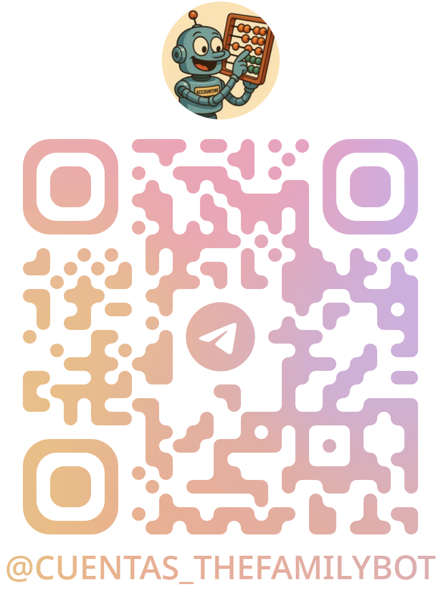

# Introducción

**Cuentas** es una herramienta pensada para facilitar la contabilidad del hogar.  
Permite al usuario categorizar fácilmente sus gastos para luego analizarlos.  
Utiliza como interfaz un **chat de Telegram**, al que se pueden enviar imágenes, audio o texto para informar de gastos o ingresos, y estos se reflejan automáticamente en un **archivo de Google Sheets personal**.

**APIs utilizadas:** Mistral OCR, OpenAI LLM, Google Drive, Google Sheets, Telegram.

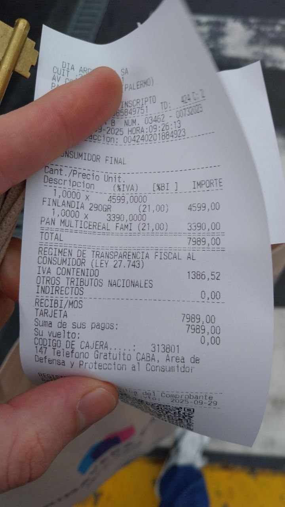

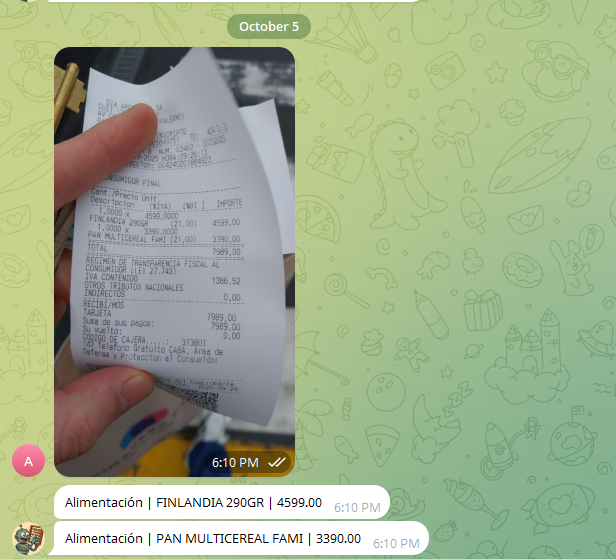

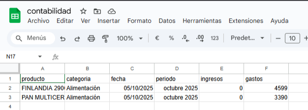

**Las categorías (en el ejemplo, "alimentación") son definidas en la hoja "mis categorías" del Sheets donde se suben los datos.  
La siguiente imagen muestra las categorías predefinidas:**

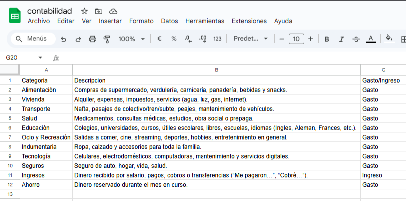

| **Categoría**         | **Descripción**                                                                                                                                                      | **Gasto/Ingreso** |
|------------------------|----------------------------------------------------------------------------------------------------------------------------------------------------------------------|-------------------|
| Alimentación           | Compras de supermercado, verdulería, carnicería, panadería, bebidas y snacks.                                                                                        | Gasto             |
| Vivienda               | Alquiler, expensas, impuestos, servicios (agua, luz, gas, internet).                                                                                                 | Gasto             |
| Transporte             | Nafta, pasajes de colectivo/tren/subte, peajes, mantenimiento de vehículos.                                                                                          | Gasto             |
| Salud                  | Medicamentos, consultas médicas, estudios, obra social o prepaga.                                                                                                   | Gasto             |
| Educación              | Colegios, universidades, cursos, útiles escolares, libros, idiomas (Inglés, Alemán, Francés, etc.).                                                                  | Gasto             |
| Ocio y Recreación      | Salidas a comer, cine, streaming, deportes, hobbies, entretenimiento en general.                                                                                    | Gasto             |
| Indumentaria           | Ropa, calzado y accesorios.                                                                                                   | Gasto             |
| Tecnología             | Celulares, electrodomésticos, computadoras, mantenimiento y servicios digitales.                                              | Gasto             |
| Seguros                | Seguro de auto, hogar, vida, salud.                                                                                           | Gasto             |
| Ingresos               | Dinero recibido por salario, pagos, cobros o transferencias (“Me pagaron…”, “Cobré…”).                                        | Ingreso           |
| Ahorro                 | Dinero reservado durante el mes en curso.                                                                                    | Gasto             |

---

**Pero... ¿y si quiero categorizar más a fondo mis alimentos?**

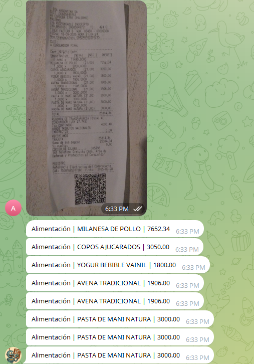

**Simplemente basta con modificar la hoja donde estas categorías están definidas.**

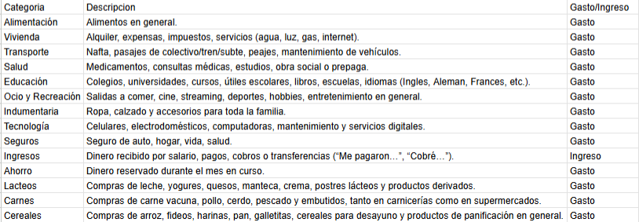

| **Categoría**        | **Descripción**                                                                                                                                                     | **Gasto/Ingreso** |
|-----------------------|---------------------------------------------------------------------------------------------------------------------------------------------------------------------|-------------------|
| Alimentación          | Alimentos en general.                                                                                                                                               | Gasto             |
| Vivienda              | Alquiler, expensas, impuestos, servicios (agua, luz, gas, internet).                                                                                                | Gasto             |
| Transporte            | Nafta, pasajes, peajes, mantenimiento de vehículos.                                                                                                                 | Gasto             |
| Salud                 | Medicamentos, consultas médicas, estudios, obra social o prepaga.                                                                                                   | Gasto             |
| Educación             | Colegios, universidades, cursos, libros, idiomas.                                                                             | Gasto             |
| Ocio y Recreación     | Salidas, cine, streaming, deportes, hobbies, entretenimiento.                                                                  | Gasto             |
| Indumentaria          | Ropa, calzado y accesorios.                                                                                                   | Gasto             |
| Tecnología            | Celulares, electrodomésticos, computadoras, servicios digitales.                                                              | Gasto             |
| Seguros               | Seguro de auto, hogar, vida, salud.                                                                                           | Gasto             |
| Ingresos              | Dinero recibido por salario, pagos, cobros o transferencias.                                                                  | Ingreso           |
| Ahorro                | Dinero reservado durante el mes en curso.                                                                                    | Gasto             |
| Lácteos               | Leche, yogures, quesos, manteca, crema, postres lácteos y derivados.                                                         | Gasto             |
| Carnes                | Carne vacuna, pollo, cerdo, pescado y embutidos.                                                                             | Gasto             |
| Cereales              | Arroz, fideos, harinas, pan, galletitas, cereales para desayuno y panificación.                                              | Gasto             |

---

**Y Cuentas ya es capaz de adaptarse a nuestras categorías personalizadas.**

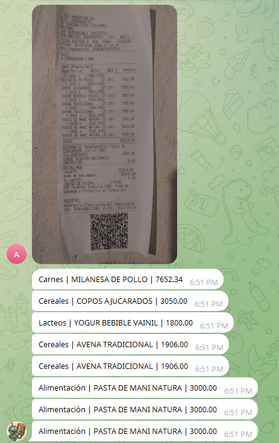

**Cuentas también lleva el control de cuánto dinero nos queda para el mes, y podemos consultarlo cuando lo necesitemos.**

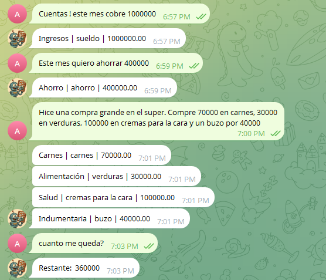

---

# Registro automático

**Cuentas** permite el registro automático de nuevos usuarios.  
Para comenzar a usarlo, solo hay que indicarle un correo electrónico.

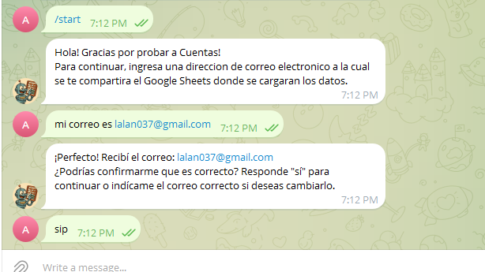

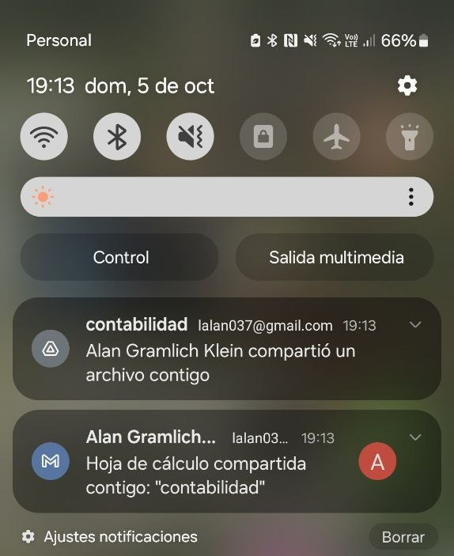

---

Te invito a comenzar a usarlo o descargar la plantilla (presente en este repositorio) y evaluarlo por tu cuenta.  
> **Nota:** El registro puede fallar ocasionalmente. Contactarse a alangramlichklein@gmail.com por cualquier inconveniente.

